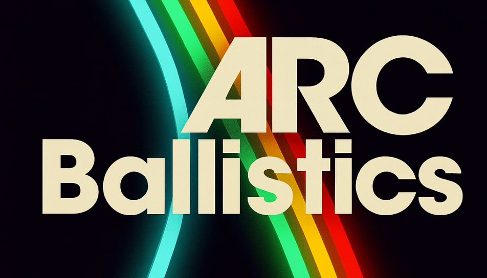
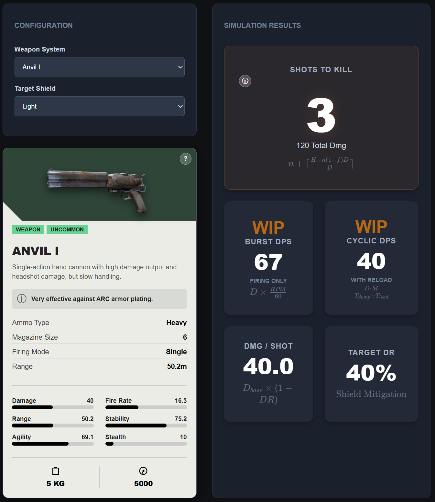

# ARC Ballistics



[](#)
-00ADD8)


ARC Ballistics is a lightweight damage-simulation tool for the game *ARC Raiders*.  
It calculates damage output based on shields, damage reduction (DR) and reload mechanics to provide reliable **Shots-to-Kill**, **Burst DPS**, and **Cyclic DPS** values.

---

## Preview



---

## Features

- **Precise STK Calculation:** Accurate determination of Shots-to-Kill.
- **DPS Metrics: WIP** Computes Burst DPS and Cyclic DPS.
- **Burst DPS Notice:** Burst DPS is currently approximate, because in-game RPM values are UI-only and not exact.
- **Defense Simulation:** Supports shield values and DR (damage reduction).
- **Local Cache:** Stores weapon data locally for fast lookup.
- **Single-Binary Architecture:**
  - Backend: Go (Gin)
  - Frontend: Svelte (static)

---

## Installation

### Backend (Go / Gin)

1. Clone the repository:
   ```sh
   git clone https://github.com/aebyss/arcballistics.git
   cd arcballistics
2. Run 
   ```sh
   go mod tidy
   go run main.go

### Frontend Svelte

1. Navigate to the repository:
   ```sh
   cd frontend
   npm install
   npm run dev
2. Open in browser


Contributions are welcome! Please feel free to submit a Pull Request.

Made with ❤️ for the ARC Raiders community